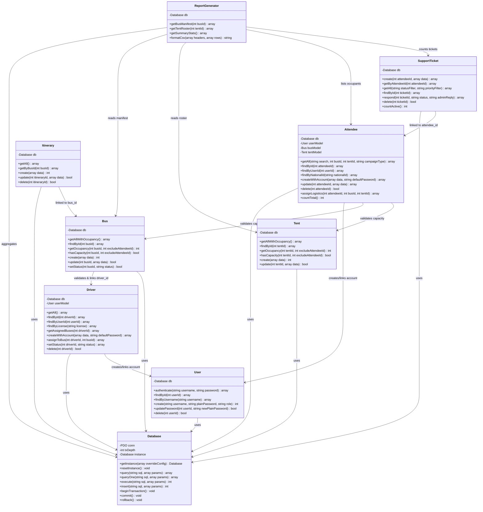

# UML Class Diagram — PHP Backend Architecture

Models all **9 Object-Oriented PHP classes** implemented in `src/classes/`, matching exact properties, method signatures, and associations.

```mermaid
classDiagram
    class Database {
        -PDO conn
        -int txDepth
        -Database instance
        +getInstance(array overrideConfig) Database
        +resetInstance() void
        +query(string sql, array params) array
        +queryOne(string sql, array params) array
        +execute(string sql, array params) int
        +insert(string sql, array params) int
        +beginTransaction() void
        +commit() void
        +rollback() void
    }

    class User {
        -Database db
        +authenticate(string username, string password) array
        +findById(int userId) array
        +findByUsername(string username) array
        +create(string username, string plainPassword, string role) int
        +updatePassword(int userId, string newPlainPassword) bool
        +delete(int userId) bool
    }

    class Driver {
        -Database db
        -User userModel
        +getAll() array
        +findById(int driverId) array
        +findByUserId(int userId) array
        +findByLicense(string license) array
        +getAssignedBuses(int driverId) array
        +createWithAccount(array data, string defaultPassword) array
        +assignToBus(int driverId, int busId) array
        +setStatus(int driverId, string status) array
        +delete(int driverId) bool
    }

    class Attendee {
        -Database db
        -User userModel
        -Bus busModel
        -Tent tentModel
        +getAll(string search, int busId, int tentId, string campaignType) array
        +findById(int attendeeId) array
        +findByUserId(int userId) array
        +findByNationalId(string nationalId) array
        +createWithAccount(array data, string defaultPassword) array
        +update(int attendeeId, array data) array
        +delete(int attendeeId) bool
        +assignLogistics(int attendeeId, int busId, int tentId) array
        +countTotal() int
    }

    class Bus {
        -Database db
        +getAllWithOccupancy() array
        +findById(int busId) array
        +getOccupancy(int busId, int excludeAttendeeId) int
        +hasCapacity(int busId, int excludeAttendeeId) bool
        +create(array data) int
        +update(int busId, array data) bool
        +setStatus(int busId, string status) bool
    }

    class Tent {
        -Database db
        +getAllWithOccupancy() array
        +findById(int tentId) array
        +getOccupancy(int tentId, int excludeAttendeeId) int
        +hasCapacity(int tentId, int excludeAttendeeId) bool
        +create(array data) int
        +update(int tentId, array data) bool
    }

    class Itinerary {
        -Database db
        +getAll() array
        +getByBusId(int busId) array
        +create(array data) int
        +update(int itineraryId, array data) bool
        +delete(int itineraryId) bool
    }

    class SupportTicket {
        -Database db
        +create(int attendeeId, array data) array
        +getByAttendeeId(int attendeeId) array
        +getAll(string statusFilter, string priorityFilter) array
        +findById(int ticketId) array
        +respond(int ticketId, string status, string adminReply) array
        +delete(int ticketId) bool
        +countActive() int
    }

    class ReportGenerator {
        -Database db
        +getBusManifest(int busId) array
        +getTentRoster(int tentId) array
        +getSummaryStats() array
        +formatCsv(array headers, array rows) string
    }

    User --> Database : uses
    Driver --> Database : uses
    Driver --> User : creates/links account
    Bus --> Driver : validates & links driver_id
    Bus --> Database : uses
    Attendee --> Database : uses
    Attendee --> User : creates/links account
    Attendee --> Bus : validates capacity & status
    Attendee --> Tent : validates capacity
    Tent --> Database : uses
    Itinerary --> Database : uses
    Itinerary --> Bus : linked to bus_id
    SupportTicket --> Database : uses
    SupportTicket --> Attendee : linked to attendee_id
    ReportGenerator --> Database : aggregates
    ReportGenerator --> Bus : reads manifest
    ReportGenerator --> Tent : reads roster
    ReportGenerator --> Attendee : lists occupants
    ReportGenerator --> SupportTicket : counts tickets
```
